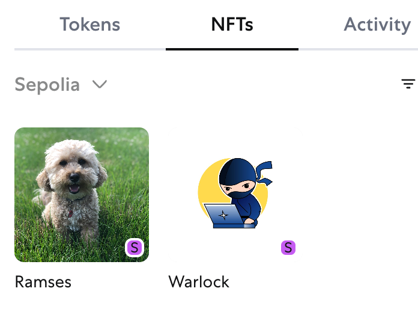

# Simple Mint NFT on testnet

Getting started

```shell
# npx hardhat run scripts/deploy.js --network sepolia
ready to deploy, owner address: 0xA4a8dcE9F35C75f57dF0449B0543Cd767BeF6305
contract MandyNFT is deployed successfully at address 0x005a17326DcE17a742684775f58683e56F306fba
wait for confirmations
deploy confirmed

# node scripts/mint-nft.js
NFT Minted! Check it out at: https://sepolia.etherscan.io/tx/0x99c1a2e2da678d05608e7d6a96f5fc977f103047b77376f0f1418518c3df310f
```

# one of minted NFT

[oversea testnet has been deprecated](https://testnets.opensea.io/assets/sepolia/0x005a17326dce17a742684775f58683e56f306fba/2)

check on metamask:



# References

https://www.alchemy.com/docs/how-to-create-an-nft