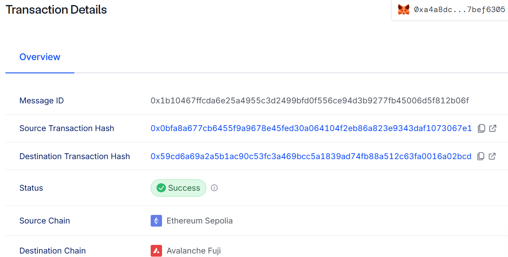
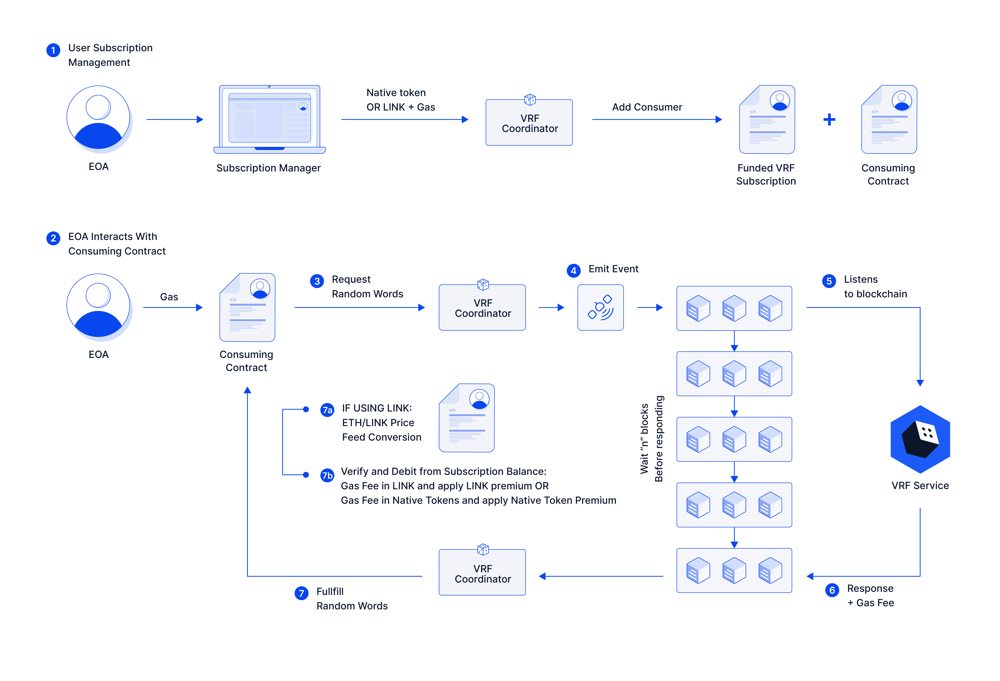

# Experimentation against chainlink infrastruture with hardhat

## Cross-chain transfer NFT between sepolia and fuji

Getting started:

```
npx hardhat deploy
npx hardhat test
npx hardhat deploy --network sepolia --tags srcchain
npx hardhat deploy --network fuji --tags destchain

npx hardhat check-nft --network sepolia
npx hardhat mint-nft --network sepolia --uri https://gateway.pinata.cloud/ipfs/xxx

npx hardhat rw-permission --network sepolia --tokenid 0 --setting true
npx hardhat rw-permission --network sepolia --tokenid 0 --approve true

npx hardhat lock-and-cross --network sepolia --tokenid 0

npx hardhat rw-permission --network fuji --tokenid 0 --approve true
npx hardhat rw-permission --network fuji --tokenid 0 --setting true

npx hardhat rw-permission --network fuji --tokenid 0 --setting true

```

### Effects

- run nft-via-ccip demo: deploy locally


- CCIP transaction details on CCIP explorer



## Dice-Roll contract based on VRF20

VRF flow of bird view (from official doc):



For this contract, I have made random request on Remix, so here it will return `Already rolled` error

```
$ node scripts/query-vrf.js 0xb64B94188E5143156C113601AE2af9cB20C45a29
[dotenv@17.2.0] injecting env (5) from .env (tip: ⚙️  enable debug
logging with { debug: true })
owner is 0xA4a8dcE9F35C75f57dF0449B0543Cd767BeF6305
Error: execution reverted: "Already rolled" (action="estimateGas", data="0x08c379a00000000000000000000000000000000000000000000000000000000000000020000000000000000000000000000000000000000000000000000000000000000e416c726561647920726f6c6c6564000000000000000000000000000000000000", reason="Already rolled", transaction={ "data": "0xdd02d9e5000000000000000000000000a4a8dce9f35c75f57df0449b0543cd767bef6305", "from": "0xA4a8dcE9F35C75f57dF0449B0543Cd767BeF6305", "to": "0xb64B94188E5143156C113601AE2af9cB20C45a29" }, invocation=null, revert={ "args": [ "Already rolled" ], "name": "Error", "signature": "Error(string)" }, code=CALL_EXCEPTION, version=6.15.0)
    at makeError (E:\workspace\web3\solidity-demos\cross-chain-with-ccip\node_modules\ethers\lib.commonjs\utils\errors.js:137:21)
```

But I made a variant one with function `clearResult`, so that we can request multiple times.

## RWA - put housing price on chain

chainlink RWA courses:

https://cll-devrel.gitbook.io/mandarin-tokenized-rwa-bootcamp-sep-oct-2024/

```
npx hardhat run scripts/rwa-1_deploy-RealEstateToken.js --network fuji
npx hardhat run scripts/rwa-2_deploy-Issuer.js --network fuji
```

After deployement, do

```
$ npx hardhat set-issuer --tokenaddr 0x9C406980106d46c21b7953Fd3A5279fE62FF80ea --issueraddr 0xcE8C2291733071ecA5439A9F57F8285Cebe24b92 --network
fuji
[dotenv@17.2.0] injecting env (7) from .env (tip: 🔐 prevent building .env in docker: https://dotenvx.com/prebuild)
signer: 0xA4a8dcE9F35C75f57dF0449B0543Cd767BeF6305
token total supply:0, setIssuer done
```

run `issue` call:
```
$ npx hardhat issue --amount 20 --issueraddr 0xcE8C2291733071ecA5439A9F57F8285Cebe24b92 --network fuji
[dotenv@17.2.0] injecting env (9) from .env (tip: ⚙️  write to custo
m object with { processEnv: myObject })
[dotenv@17.2.0] injecting env (0) from .env (tip: ⚙️  override exist
ing env vars with { override: true })
signer: 0xA4a8dcE9F35C75f57dF0449B0543Cd767BeF6305
issue waited, tx: 0x495221ce06d9610361c72ac15a6da8f3922e274f5a9bc40233c68d2bfe53b935
```

After multiple trials, I always got the [error](https://github.com/baiwfg2/solidity-demos/issues/9) as many other did (heard of that in chainlink discord). This needs to be checked in the future